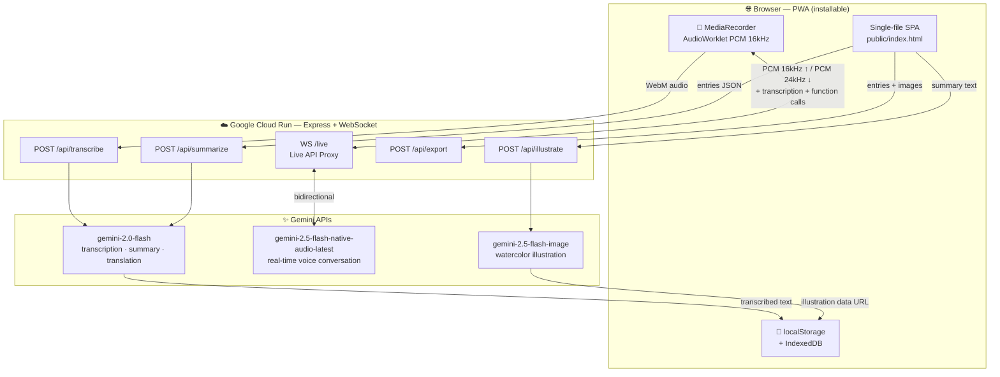

# 碎碎念 (Voice Diary)

> An AI-powered voice diary PWA with real-time conversational companion, automatic transcription, daily summaries, and illustrated memories.

**Live Demo:** https://voice-diary-947562481976.us-central1.run.app
**GitHub:** https://github.com/SANABI-LL/Voice-Diary

---

## Architecture



---

## What It Does

**碎碎念** (Suì Suì Niàn — "murmuring thoughts") is a voice-first diary app that turns spoken thoughts into structured memories:

1. **Record** — Tap to speak; `gemini-2.0-flash` transcribes audio in real time
2. **Chat with 念念 (Niannian)** — A live voice AI companion powered by `gemini-2.5-flash-native-audio-latest` that listens, responds, and saves noteworthy moments as diary entries via Function Calling
3. **Summarize** — `gemini-2.0-flash` distills the day's entries into a warm, life-coach-style summary
4. **Illustrate** — `gemini-2.5-flash-image` generates a unique watercolor illustration for each day
5. **Review** — Calendar view with illustration thumbnails, flip-card album, and Word export

Supports English and Chinese with auto-translation between stored summaries and current UI language.

---

## Gemini APIs Used

| Feature | Model |
|---------|-------|
| Voice transcription | `gemini-2.0-flash` (inline base64 audio) |
| Real-time voice conversation | `gemini-2.5-flash-native-audio-latest` (Live API via WebSocket) |
| Daily summary generation | `gemini-2.0-flash` |
| AI illustration generation | `gemini-2.5-flash-image` |
| Summary translation | `gemini-2.0-flash` |

**SDK:** `@google/genai` for Live API and illustration; `@google/generative-ai` for transcription/summarize.

---

## Architecture

```
Browser (PWA)
│
├── AudioWorklet (PCM 16kHz capture)
├── MediaRecorder (WebM audio)
├── localStorage (entries, summaries, translations)
└── IndexedDB (audio blobs, illustrations)
       │
       │  REST  (transcribe / summarize / illustrate / export / translate)
       │  WebSocket /live  (real-time bidirectional voice)
       ▼
Express Server — Google Cloud Run (Node.js 20)
│
├── POST /api/transcribe   → gemini-2.0-flash  (inline base64 WebM)
├── POST /api/summarize    → gemini-2.0-flash
├── POST /api/illustrate   → gemini-2.5-flash-image
├── POST /api/translate    → gemini-2.0-flash
├── POST /api/export       → docx library → Word file download
└── WS   /live             → Gemini Live API
                               ├── Bidirectional PCM audio (16kHz up / 24kHz down)
                               ├── Server-side VAD
                               ├── Input + output transcription
                               └── Function Calling
                                     save_note / get_past_entries / get_today_summary
```

---

## Local Development

### Prerequisites

- **Node.js 20 LTS** — Node 24 crashes on Windows, do not use
- A `GEMINI_API_KEY` from [Google AI Studio](https://aistudio.google.com/apikey)

### Setup

```bash
# 1. Clone the repo
git clone https://github.com/SANABI-LL/Voice-Diary.git
cd Voice-Diary

# 2. Install root dependencies (used by api/ handlers)
npm install

# 3. Install server dependencies
cd server && npm install

# 4. Create .env in the project root
#    (back out of server/ first)
cd ..
echo "GEMINI_API_KEY=AIza..." > .env

# 5. Start the development server
cd server
node --env-file=../.env index.js
```

Open **http://localhost:8080** in Chrome and allow microphone access.

> **Tip:** If transcription fails, check Chrome is using the correct microphone:
> address bar lock icon → Site settings → Microphone

**Hot-reload:**
```bash
node --env-file=../.env --watch index.js
```

> Do NOT use `vercel dev` — WebSocket is not supported there.

---

## Deploy to Google Cloud Run

### 1. Build and push the Docker image

```bash
gcloud builds submit --config cloudbuild.yaml .
```

### 2. Deploy

```bash
gcloud run deploy voice-diary \
  --image asia-east1-docker.pkg.dev/YOUR_PROJECT_ID/voice-diary/app:latest \
  --platform managed \
  --region us-central1 \
  --allow-unauthenticated \
  --port 8080 \
  --memory 512Mi \
  --cpu 1 \
  --min-instances 1 \
  --timeout 3600 \
  --set-env-vars GEMINI_API_KEY=YOUR_KEY
```

Replace `YOUR_PROJECT_ID` and `YOUR_KEY` with your values.

| Flag | Why |
|------|-----|
| `--cpu 1` | Sufficient CPU for real-time audio processing |
| `--min-instances 1` | Prevents cold starts during live voice sessions |
| `--timeout 3600` | Keeps WebSocket alive for long conversations |

---

## Project Structure

```
voice-diary/
├── public/
│   ├── index.html        # Entire frontend SPA (HTML + CSS + JS, no build step)
│   ├── manifest.json     # PWA manifest
│   └── icon.png          # App icon
├── api/
│   ├── transcribe.js     # Audio → text  (gemini-2.0-flash)
│   ├── summarize.js      # Entries → daily summary
│   ├── illustrate.js     # Summary → watercolor illustration
│   ├── translate.js      # Summary language translation
│   └── export.js         # Diary entries → Word (.docx)
├── server/
│   ├── index.js          # Express server + WebSocket Live API proxy
│   ├── Dockerfile        # Container config for Cloud Run
│   └── package.json
├── cloudbuild.yaml        # Google Cloud Build pipeline
├── package.json           # Root deps (api/ handlers)
└── .env                   # GEMINI_API_KEY (do not commit)
```

---

## Key Technical Details

- **No build step** — `public/index.html` contains all frontend HTML, CSS, and JS
- **Dual storage** — `localStorage` for text/metadata; `IndexedDB` for audio blobs and illustrations
- **Gapless audio playback** — Web Audio API with `nextPlayTime` scheduling ensures PCM chunks play back-to-back without gaps despite network jitter
- **Echo cancellation via VAD** — Client-side RMS threshold (6000) on AudioWorklet frames distinguishes direct microphone speech from speaker playback echo, preventing false barge-in triggers
- **PWA** — Installable on desktop and iOS/Android home screen

---

## Environment Variables

| Variable | Description |
|----------|-------------|
| `GEMINI_API_KEY` | Required. Get one at [aistudio.google.com/apikey](https://aistudio.google.com/apikey) |
